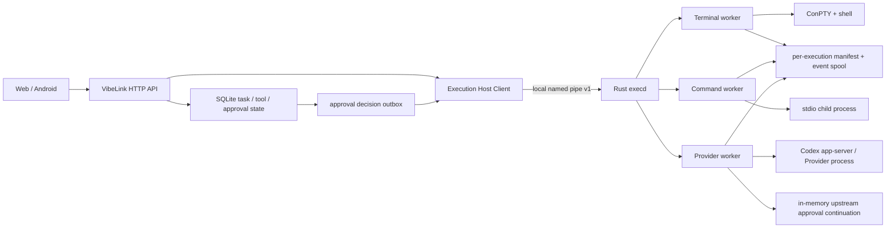
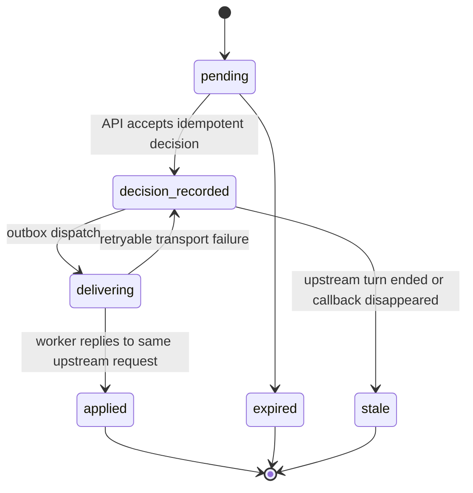

# VibeLink P0 执行接管与审批闭环方案

状态：待评审

日期：2026-07-17

## 1. 结论

这个 P0 不能按“事后接管任意已运行的 Windows 进程”来修。Windows 没有通用、可靠的机制把一个并非由 VibeLink 创建的进程重新绑定到新的 stdin/stdout/ConPTY 所有者；Codex Desktop 也没有公开稳定的内部进程、tool 输出和审批协议。

可交付且可验证的目标应改为：

1. **VibeLink 启动的执行可接回**：Terminal、Workspace command、Agent Provider 都由独立执行宿主持有，HTTP/Node/Rust front door 重启后可重连到同一个 worker、同一个 OS 子进程和同一条事件流。
2. **结构化 Provider 才承诺完整语义**：对支持稳定回调的 Provider，记录 tool call、原始输出、退出状态、归属和审批 continuation；对 CLI 观察流和 Desktop UIA 明确标注降级能力，不推断成“完整”。
3. **审批决定回到原调用**：Provider Host 保持上游连接和 pending request，移动端审批通过后响应同一个上游 request id，而不是重新创建一条近似调用。
4. **Desktop UIA 只保留兼容降级**：继续 fail-closed，但不作为第一方控制协议，也不参与 P0 的可靠性承诺。

建议采用 **Rust `execd` + 每个执行独立 worker** 的两级宿主。`execd` 负责发现、路由和健康状态；worker 独立持有 ConPTY/stdio/app-server 连接、子进程 Job Object 和本地事件 spool。Bridge 或 `execd` 重启时，worker 继续运行，新实例从 manifest 和 named pipe 重新接回。

## 2. 当前实现证据

| 问题 | 当前实现 | 直接后果 |
| --- | --- | --- |
| Terminal 句柄只在内存 | `src/terminalRuntime.js` 使用进程内 `sessions = new Map()`，结束即删除 | 服务重启后无法列出、输入、resize 或 stop 原会话 |
| Agent 不接受 live stdin | `src/agents.js` 以 `stdio: ["ignore", "pipe", "pipe"]` 启动 Provider | `writeTaskInput()` 的成功路径实际上不可用 |
| 任务恢复不恢复进程 | JSONL 恢复时显式设置 `process: null` | 只能恢复历史状态，不能继续读输出或控制子进程 |
| Workspace command 归 Node 所有 | `src/workspaces.js` 直接 `spawn()`，active controller 也在内存 | Node 重启后输出、退出码、取消能力丢失 |
| Agent tool call 只是观察 | `src/agentToolBridge.js` 从 JSON 输出推断 tool start/result | 没有阻塞点和 continuation，不能把审批写回 Provider |
| 审批恢复是分支重跑 | `src/server.js#resumeApprovedToolRun` 按 kind 重新调用本地执行器 | 只覆盖 VibeLink 自有工具，不等于继续上游 Agent 的原调用 |
| Desktop Remote 依赖 UIA | `src/codexDesktopControl.ps1` 依赖窗口、文案、坐标、剪贴板和按钮 | Electron/UI 文案变化即可破坏行为，且拿不到完整内部事件 |

本机 `codex-cli 0.117.0` 的 `codex app-server generate-json-schema --experimental` 已验证存在：

- `item/commandExecution/requestApproval`
- `item/fileChange/requestApproval`
- `item/permissions/requestApproval`
- `item/tool/call`
- `item/commandExecution/outputDelta`
- command exec 的 write、resize 和 terminate 能力

但 `codex app-server` 在 CLI help 中仍标为 experimental，因此只能通过版本探测、生成 schema 校验和 capability gate 启用，不能成为无条件兼容承诺。

## 3. P0 范围

### 必须完成

- VibeLink 新启动的 Terminal、Workspace command 和 Agent 执行由持久 worker 持有。
- Bridge/Node/Rust front door 重启后，仍可读取增量输出、写 stdin、resize、stop，并获得真实退出码。
- `execd` 重启后能从磁盘 manifest 发现仍存活的 worker，并验证 PID、进程创建时间和实例 nonce 后重连。
- Worker 断连期间的事件写入本地 spool；控制面恢复后按序、幂等地补写现有 task/tool event store。
- 对受支持的 Codex app-server 版本，tool call 和权限请求进入 VibeLink approval，决定响应同一个上游请求并继续原 turn。
- Web/Android 展示权限变化的具体范围、时效和可选决定，不再只显示抽象的“需要审批”。
- Provider registry 和 Desktop Remote 暴露真实 capability/fidelity，客户端不把采样数据显示成权威数据。

### 明确非目标

- 不接管 VibeLink 启动前已经存在的任意 OS 进程。
- 不保证 worker 自身崩溃后重新绑定其已失去句柄的子进程；worker 崩溃时通过 Job Object 终止子进程并标记 `lost`。
- 不保证 Windows 重启后继续原进程；重启后只恢复历史、最终状态和可重新开始/恢复的 Provider session。
- 不把 UIA、屏幕 OCR、窗口注入或 PTY 文本解析包装成稳定 Provider 协议。
- 不把 CLI `exec --json` 的观察事件伪装成可审批 continuation。

## 4. 目标架构



### 4.1 生命周期边界

- `vibelink.exe execd` 是本机路由和发现进程，不直接持有业务子进程句柄。
- `vibelink.exe execution-worker --manifest <path>` 每个执行一个实例，脱离 Bridge 和 `execd` 生命周期运行。
- Worker 创建并持有自己的 Windows Job Object；业务子进程加入该 Job，worker 退出时子进程被清理，避免留下不可控孤儿进程。
- Worker 原子写入 `data/executions/<executionId>/manifest.json`，事件写入分段 spool，并监听仅限当前用户/SYSTEM 的 named pipe。
- `execd` 启动时扫描 manifest，通过 `pid + processStartTime + instanceNonce + pipe handshake` 校验身份；PID 单独不能作为重连依据。
- Bridge 只持有 `executionId` 和事件 cursor，不持有 OS 句柄。

### 4.2 执行类型

| 类型 | 后端 | 可写 stdin | 可 resize | 可靠输出 | 审批 continuation |
| --- | --- | --- | --- | --- | --- |
| `terminal` | ConPTY | 是 | 是 | 是，受 spool retention 约束 | 不适用 |
| `command` | piped stdio | 默认否 | 否 | 是，stdout/stderr 分流 | VibeLink 运行前审批 |
| `provider.cli` | CLI JSONL/stdout | 仅 prompt 输入阶段 | 否 | 原始流可靠，tool 语义为 observed | 否 |
| `provider.appServer` | JSON-RPC/WebSocket | 通过协议 | 协议决定 | 结构化事件可靠 | 是，版本受支持时 |
| `desktop.uia` | Windows UIA | 近似发送 | 否 | sampled/unavailable | 否 |

Agent 的“继续对话”不再调用 live stdin：当前 turn 结束后创建一个新的 `resume` turn。只有 Provider 明确声明 `liveInput=true` 时才开放运行中输入。

## 5. 稳定接口设计

### 5.1 内部 named-pipe 协议

协议使用带版本的 JSON message，不复用当前仅适合父子 stdio 的 sidecar 协议。

```json
{
  "protocolVersion": 1,
  "requestId": "uuid",
  "method": "execution.input",
  "params": {
    "executionId": "uuid",
    "operationId": "uuid",
    "encoding": "utf8",
    "data": "Get-Location\r\n"
  }
}
```

首版方法：

- `host.hello`
- `execution.start`
- `execution.get`
- `execution.list`
- `execution.events`
- `execution.ack`
- `execution.input`
- `execution.resize`
- `execution.signal`
- `approval.resolve`
- `host.health`

每个 mutation 必须带 `operationId`；存活 worker 对重复 operation 返回第一次结果，不能重复写 stdin、重复 signal 或重复响应上游 approval。对于 stdin 写入和上游 JSON-RPC 响应，磁盘记录与外部 side effect 之间不存在跨进程原子事务：如果 worker 在这个歧义窗口崩溃，状态必须进入 `OUTCOME_UNKNOWN`，控制面不得自动重放，必须由用户根据当前执行状态选择继续、停止或重开。

统一错误 envelope：

```json
{
  "requestId": "uuid",
  "error": {
    "code": "EXECUTION_NOT_ATTACHED",
    "message": "Execution worker is not reachable.",
    "retryable": true,
    "details": {}
  }
}
```

### 5.2 对外 HTTP 兼容

第一阶段不删除或改名现有 endpoint：

- `POST /api/workspaces/:id/terminal-session`
- `GET /api/terminal-sessions`
- `GET /api/terminal-sessions/:id`
- `POST /api/terminal-sessions/:id/input`
- `POST /api/terminal-sessions/:id/resize`
- `POST /api/tool-runs/:id/stop`
- `POST /api/approvals/:id/decision`

保持 `toolRunId` 作为现有客户端的 session id，内部新增独立 `executionId`。响应只增加可选字段：

- `executionId`
- `owner`: `legacy-node | execution-host | external`
- `attachState`: `attached | reconnecting | unreachable | lost | external`
- `hostInstanceId`
- `processStartedAt`
- `lastHostSeq`
- `capabilities`
- `fidelity`

新客户端 mutation 发送 `Idempotency-Key`；旧客户端不发送时服务端生成 operation id，但不会承诺网络重试的 exactly-once。

### 5.3 事件和 cursor

- Worker 为每个 execution 生成严格递增 `hostSeq`，event id 固定为 `<executionId>:<hostSeq>`。
- Bridge 将 worker 事件映射到现有 task/tool events，SQLite cursor 继续作为对外 catch-up/SSE cursor。
- `execution_bindings.last_ingested_host_seq` 与事件插入在同一事务提交。
- 只有 SQLite 提交成功后才向 worker 发送 ack；重连后从 ack 继续 replay。
- Spool 超额时不得静默丢数据。滚动前写入 `output.truncated` 事件，并保留退出、审批、状态变化等控制事件；大输出可保存为 artifact 引用，避免塞入 SQLite。

## 6. 审批状态机

当前 `pending -> approved/denied` 不足以表示“用户做了决定”和“决定已被上游原调用接受”的差别。目标状态：



关键规则：

- Provider Host 收到上游 approval request 时保存连接内 continuation，并持久化不含秘密的 `continuationRef`、thread/turn/item/approval 标识。
- API 决策先以事务写 `approval_decisions + approval_outbox`，dispatcher 再交给 worker；不能先把 tool run 标成 resumed。
- Worker 校验 `continuationRef`、允许的 decision、turn 状态和 expected version，然后只响应一次原 JSON-RPC request id。
- Worker 收到上游后续事件后发 `approval.applied`；Bridge 再把 approval/tool run 更新为最终状态。
- 重复决策返回第一次结果；相反决策返回 `409 APPROVAL_ALREADY_DECIDED`；已结束 turn 返回 `409 APPROVAL_STALE`，不得重跑 tool。
- 旧版 `{ decision: "approve" }` 只映射为单次 `accept`，绝不自动映射为 `acceptForSession` 或扩大权限。

权限解释必须展示：当前权限、请求权限、增量差异、作用域、原因和 Provider 提供的可选决定。至少覆盖文件 read/write roots、network、sandbox、command actions、turn/session scope。

## 7. Provider 能力分级

`providerRegistry` 从简单布尔值升级为可探测的 capability/fidelity：

```json
{
  "executionOwnership": "vibelink-host",
  "reattach": true,
  "structuredToolEvents": "authoritative",
  "toolOutput": "complete",
  "exitStatus": "authoritative",
  "approvalContinuation": true,
  "liveInput": false,
  "protocol": "codex-app-server",
  "protocolVersion": "probed"
}
```

Codex app-server 启用门槛：

1. 运行当前安装版本的 schema generation/probe。
2. 必需 request、response、notification shape 均通过 fixture 校验。
3. 双客户端 resume、tool output、command/file/permission approval continuation canary 通过。
4. 未知或不兼容版本自动降级到 CLI provider；不得部分启用审批。

Desktop Remote 固定报告：

- `executionOwnership=external`
- `reattach=false`
- `structuredToolEvents=sampled`
- `toolOutput=sampled`
- `exitStatus=unavailable`
- `approvalContinuation=false`
- `controlProtocol=windows-uia`

## 8. 数据模型

新增表建议：

### `execution_bindings`

- `id`, `kind`, `task_id`, `tool_run_id`, `provider`
- `owner`, `status`, `attach_state`
- `worker_pid`, `process_pid`, `process_started_at`
- `worker_instance_id`, `protocol_version`, `capabilities_json`
- `last_seen_host_seq`, `last_ingested_host_seq`, `last_acked_host_seq`
- `created_at`, `updated_at`, `ended_at`, `exit_code`, `signal`, `lost_reason`

### `approval_outbox`

- `id`, `approval_id`, `operation_id`, `continuation_ref`
- `decision_json`, `status`, `attempts`, `next_attempt_at`
- `created_at`, `updated_at`, `delivered_at`, `applied_at`, `last_error`

现有 `approval_requests` 增加可选字段：

- `provider`, `thread_id`, `turn_id`, `item_id`
- `continuation_ref`, `decision_version`, `delivery_status`
- `requested_permissions_json`, `available_decisions_json`

Manifest、pipe token、完整环境变量和 Provider 凭据不进入公开 API。命令、路径和权限详情继续经过 allowed roots、审计脱敏和设备授权。

## 9. 实施任务

## Task 1: 固化 ADR、能力矩阵和协议 fixture

**Description:** 记录“不接管任意外部进程”的边界、两级宿主决策、恢复保证和 app-server experimental gate，并建立内部协议与 Provider fixture。

**Acceptance criteria:**

- [x] ADR 明确支持/不支持的 restart 边界和故障语义。
- [x] execution/approval/provider contract 有版本、输入输出和统一错误定义。
- [x] 当前 Codex schema probe 产出可审计的 capability 结果，不提交整份易漂移生成物。

**Verification:**

- [x] Contract fixture tests 能识别缺失方法、字段漂移和不支持版本。
- [x] `npm run openapi:gen` 后现有 HTTP contract 无破坏性变化。

**Dependencies:** None.

**Files likely touched:** `docs/decisions/ADR-0010-durable-execution-host.md`, `docs/execution-host-protocol.md`, `tools/codex-app-server/contract-probe.mjs`, `test/codexAppServerContract.test.js`.

**Estimated scope:** Medium.

## Task 2: 建立 execution 与 approval outbox 持久模型

**Description:** 添加 execution binding、host cursor、approval continuation 和 outbox 数据模型，保留现有 task/tool/approval API。

**Acceptance criteria:**

- [ ] Migration 可重复执行，旧数据库无数据丢失。
- [ ] Event ingest 与 `last_ingested_host_seq` 同事务、幂等。
- [ ] Approval decision 与 outbox 同事务，重复 operation 不产生第二条命令。

**Verification:**

- [ ] DB migration、duplicate replay、outbox retry 和 stale decision tests 通过。

**Dependencies:** Task 1.

**Files likely touched:** `src/db.js`, `src/eventStore.js`, `test/executionBindingDb.test.js`, `test/approvalOutboxDb.test.js`.

**Estimated scope:** Medium.

## Task 3: 实现 Rust execd 发现与路由

**Description:** 在现有 `vibelink.exe` 增加 `execd` 模式、named-pipe v1 handshake、manifest 扫描和 worker identity 校验。

**Acceptance criteria:**

- [ ] `execd` 可启动/发现/list/get worker，并拒绝 PID 复用和 forged manifest。
- [ ] Named pipe 仅当前用户/SYSTEM 可访问，所有边界输入有大小和 schema 校验。
- [ ] `execd` 重启后能重新连接仍存活的 fixture worker。

**Verification:**

- [ ] Rust protocol、ACL、manifest recovery 和 restart integration tests 通过。

**Dependencies:** Task 1.

**Files likely touched:** `apps/windows/src/main.rs`, `apps/windows/src/execution_daemon.rs`, `apps/windows/src/execution_protocol.rs`, `apps/windows/Cargo.toml`, `apps/windows/tests/execution_daemon.rs`.

**Estimated scope:** Medium.

## Task 4: 实现 execution worker、ConPTY 和事件 spool

**Description:** Worker 持有 terminal/stdio 子进程、Job Object、input/resize/signal 和可 replay 的分段事件 spool。

**Acceptance criteria:**

- [ ] Terminal 支持 UTF-8、ANSI、stdin、resize、stop 和真实 exit code。
- [ ] Command 支持 stdout/stderr 分流、timeout/cancel 和真实 exit/signal。
- [ ] Worker 脱离父进程后继续运行；worker 崩溃时 Job Object 清理业务子进程并留下 `lost` 证据。

**Verification:**

- [ ] Rust PTY/stdio、spool replay、quota marker、parent restart 和 worker crash tests 通过。

**Dependencies:** Task 3.

**Files likely touched:** `apps/windows/src/execution_worker.rs`, `apps/windows/src/execution_spool.rs`, `apps/windows/src/windows_process.rs`, `apps/windows/src/main.rs`, `apps/windows/tests/execution_worker.rs`.

**Estimated scope:** Medium.

## Checkpoint A: 宿主基础

- [ ] 同一 terminal 在 Bridge 未运行时继续输出。
- [ ] 重启 `execd` 后 worker id、child PID、process start time 不变。
- [ ] replay 无丢失、无重复，输入/resize/stop 仍可用。
- [ ] 未授权 named-pipe 客户端和 forged manifest 被拒绝。

## Task 5: 接入 Node client 并替换 Terminal 内存所有权

**Description:** 新建 execution host client，保持现有 terminal HTTP endpoint 和 `toolRunId`，将 `terminalRuntime` 改为兼容 facade。

**Acceptance criteria:**

- [ ] 新 terminal 默认由 execution host 启动，现有 Web/Android 不改请求即可使用。
- [ ] list/get/input/resize/stop 来自 host 状态，不再依赖进程内 Map。
- [ ] Legacy session 与 host session 可并存，响应通过 `owner/attachState` 区分。

**Verification:**

- [ ] 现有 terminal encoding test 与新增 API compatibility/restart tests 通过。

**Dependencies:** Tasks 2 and 4.

**Files likely touched:** `src/executionHostClient.js`, `src/terminalRuntime.js`, `src/server.js`, `test/terminalExecutionHost.test.js`, `test/terminalRuntimeEncoding.test.js`.

**Estimated scope:** Medium.

## Task 6: 迁移 Workspace command 执行所有权

**Description:** 将 streaming workspace command 从 Node `spawn()` 迁到 worker，保留风险分析、allowed roots、tool run 和审计语义。

**Acceptance criteria:**

- [ ] foreground/background command 输出、timeout、cancel、exit code 与现有 API 兼容。
- [ ] Node 重启后 command 继续运行，恢复后补齐 tool events 和最终状态。
- [ ] Rollback 只影响新执行，已由 worker 持有的命令不被杀死或迁回 Node。

**Verification:**

- [ ] Command contract、approval、cancel、restart 和 duplicate replay tests 通过。

**Dependencies:** Task 5.

**Files likely touched:** `src/workspaces.js`, `src/server.js`, `src/executionHostClient.js`, `test/workspaceCommandExecutionHost.test.js`, `test/workspacesFileMutation.test.js`.

**Estimated scope:** Medium.

## Task 7: 迁移 Agent CLI 执行并修正输入语义

**Description:** 将 `agents.js` 的 Provider CLI 进程交给 worker，保存完整原始 stdout/stderr/exit，并把运行中消息改为排队后的 resume turn。

**Acceptance criteria:**

- [ ] Bridge 重启期间 Agent CLI 继续运行，恢复后输出和退出状态一致。
- [ ] CLI Provider 不再错误声明 live stdin；新消息在当前 turn 完成后以 resume 执行。
- [ ] Observed tool events 明确标注 fidelity，不能变成 authoritative approval。

**Verification:**

- [ ] Fake Provider restart、queued resume、exit/error 和 event ordering tests 通过。

**Dependencies:** Tasks 5 and 6.

**Files likely touched:** `src/agents.js`, `src/providerRegistry.js`, `src/executionHostClient.js`, `test/agentExecutionHost.test.js`, `test/agentsWorkingDir.test.js`.

**Estimated scope:** Medium.

## Task 8: 实现启动 reconciliation 与事件摄取

**Description:** Bridge 启动时对 SQLite execution bindings 与 host manifest 做双向核对，重放未 ack 事件并收敛 orphan/unreachable/lost 状态。

**Acceptance criteria:**

- [ ] 存活 worker 自动恢复 attached，短暂不可达进入 reconnecting，不立即判死。
- [ ] PID 不匹配、worker 已退出或 spool 损坏有确定且可审计的终态。
- [ ] Task/tool/approval 状态由 worker 控制事件收敛，不能只靠历史文本猜测。

**Verification:**

- [ ] Crash matrix 覆盖 Bridge、execd、worker、child 分别退出和恢复。

**Dependencies:** Tasks 2, 5, 6, and 7.

**Files likely touched:** `src/executionReconciler.js`, `src/server.js`, `src/db.js`, `src/toolRuntime.js`, `test/executionRecovery.test.js`.

**Estimated scope:** Medium.

## Checkpoint B: VibeLink 自有执行 P0

- [ ] Terminal、command、Agent CLI 均由 worker 持有。
- [ ] Bridge 与 `execd` 各重启一次，执行 PID 不变且事件无重复。
- [ ] Worker/child 故障不产生假 running 状态。
- [ ] 旧 Web/Android 客户端仍可完成 terminal、command、task 流程。

## Task 9: 建立 Codex app-server Provider adapter

**Description:** Worker 启动并持有 app-server 与 JSON-RPC 连接，按安装版本 probe 结果归一化 thread/turn/item/tool/output/exit 事件。

**Acceptance criteria:**

- [ ] 受支持版本提供 authoritative tool identity、output、status 和 thread/turn 归属。
- [ ] 未知 schema、缺失方法或 probe 失败时整套 adapter fail-closed 并降级 CLI。
- [ ] Bridge 重启不关闭 app-server 连接；恢复后仍能收到同一 turn 的后续事件。

**Verification:**

- [ ] Fake JSON-RPC contract tests 和真实本机 two-client/restart canary 通过。

**Dependencies:** Tasks 4, 7, and 8.

**Files likely touched:** `apps/windows/src/codex_app_server.rs`, `apps/windows/src/execution_worker.rs`, `src/providerRegistry.js`, `test/codexAppServerProvider.test.js`, `tools/codex-app-server/contract-probe.mjs`.

**Estimated scope:** Medium.

## Task 10: 打通 Provider approval continuation

**Description:** 将 app-server command/file/permission approval request 映射到 VibeLink approval/outbox，worker 响应同一个上游请求并等待 applied 证据。

**Acceptance criteria:**

- [ ] 单次 accept、session accept、decline、cancel 和 permission grant 均按 Provider available decisions 校验。
- [ ] Bridge 重启后 pending approval 仍可决定，原 turn 继续，tool 不重复执行。
- [ ] Duplicate、opposite、expired、stale、host unreachable 都有稳定错误和审计事件。

**Verification:**

- [ ] 端到端测试证明 request id/continuation 未变化、只响应一次、原 tool call 继续并产生最终输出。

**Dependencies:** Tasks 2, 8, and 9.

**Files likely touched:** `src/toolRuntime.js`, `src/server.js`, `src/approvalDispatcher.js`, `apps/windows/src/codex_app_server.rs`, `test/approvalContinuation.test.js`.

**Estimated scope:** Medium.

## Task 11: 更新 Web/Android 权限解释与恢复状态

**Description:** 客户端展示 current/requested permission diff、scope、available decisions、decision delivery 状态和 execution attach 状态。

**Acceptance criteria:**

- [ ] 用户能区分“决定已记录”“已送达 Provider”“原调用已继续”和“已 stale”。
- [ ] 默认 approve 仅表示单次 accept；session/policy 扩权必须显式选择并显示范围。
- [ ] reconnecting/unreachable/lost/external 有不同状态和允许操作。

**Verification:**

- [ ] Web reducer/render tests、Android ViewModel/contract tests 和真机弱网恢复检查通过。

**Dependencies:** Tasks 8 and 10.

**Files likely touched:** `apps/web/src/main.jsx`, `apps/web/src/remoteTranscript.js`, `apps/android/app/src/main/java/com/vibelink/app/network/ApiModels.kt`, `apps/android/app/src/main/java/com/vibelink/app/ui/components/ToolCallCard.kt`, `apps/android/app/src/test/java/com/vibelink/app/ui/screens/TaskApprovalHandoffTest.kt`.

**Estimated scope:** Medium.

## Task 12: 收紧 Desktop Remote 与分阶段切换

**Description:** 将 Desktop UIA 明确为 external/sample-only adapter，增加能力提示和 rollout flags，按新执行分片切换，不迁移已运行 legacy 进程。

**Acceptance criteria:**

- [ ] Desktop Remote 不再显示权威 exit code、完整 output 或可恢复审批。
- [ ] `off/shadow/on` rollout 对新执行生效，rollback 不杀死 worker-owned in-flight execution。
- [ ] Product status、architecture、OpenAPI 和 doctor/status capability 保持一致。

**Verification:**

- [ ] Desktop fail-closed regression、mixed ownership、rollback、package 和 public canary 通过。

**Dependencies:** Tasks 5-11.

**Files likely touched:** `src/desktopRemote.js`, `src/statusRuntime.js`, `docs/product-status.md`, `docs/vibelink-agent-architecture.md`, `docs/openapi.json`.

**Estimated scope:** Medium.

## Checkpoint C: P0 完成

- [ ] 新执行 100% 有 owner、execution id、真实 attach state 和可审计退出状态。
- [ ] Bridge/execd restart drill 中 Terminal、command、Agent turn 和 pending approval 全部通过。
- [ ] Codex supported-version canary 中 command/file/permission approval 继续同一调用。
- [ ] CLI/Desktop 降级模式不宣称不存在的能力。
- [ ] 全量 Node/Rust/Web/Android focused suites、Windows package 和回滚演练通过。

## 10. Rollout 与回滚

建议 flags：

- `VIBELINK_EXECUTION_HOST=off|canary|on`
- `VIBELINK_CODEX_APP_SERVER=off|probe|on`
- `VIBELINK_APPROVAL_OUTBOX=off|shadow|on`

切换规则：

- 只对新 execution 选择 owner；in-flight execution 永远回到创建它的 owner。
- `canary` 只运行专用真实进程，不对同一用户命令双执行。
- 回滚关闭新 start 路由，但 `execd`/worker 继续托管已存在执行直到自然退出或用户 stop。
- Legacy Node-owned session 不尝试热迁移，明确显示 `owner=legacy-node` 与重启不可恢复。
- app-server probe/schema 不通过时自动降级整个 Provider adapter，不做半协议运行。

## 11. 风险与缓解

| 风险 | 影响 | 缓解 |
| --- | --- | --- |
| Worker 数量和资源占用增长 | 中 | 每 execution 隔离先换可靠性；记录 RSS/handle 数，后续再评估安全复用 |
| Spool 无界增长 | 高 | 分段、quota、artifact 外置、显式 truncation event、控制事件永不静默丢失 |
| Named pipe 被本机其他用户调用 | 严重 | 用户/SYSTEM ACL、nonce handshake、消息大小限制、身份审计 |
| PID 复用导致接错进程 | 严重 | PID + creation time + instance nonce + pipe proof 四元校验 |
| app-server experimental schema 漂移 | 高 | 每版本生成 schema、fixture gate、真实 canary、整套 fail-closed 降级 |
| 审批已记录但未送达 | 高 | 事务 outbox、delivery/applied 分态、幂等 retry、stale 终态 |
| Rollback 杀死正在运行执行 | 高 | owner sticky；rollback 只停止新路由，不回收现有 worker |
| UI 将 sampled 当 authoritative | 高 | capability/fidelity 随每个来源返回，渲染层按 fidelity 限制字段和动作 |

## 12. 工期与并行顺序

单人预计 **21-31 个工程日**：

- Contract/DB：3-4 日
- execd/worker/PTY/spool：7-10 日
- Node/command/Agent/recovery：5-7 日
- Codex app-server/approval continuation：5-7 日
- Web/Android/rollout：3-5 日

依赖顺序必须保持：Contract -> DB/execd -> worker -> Node migration -> reconciliation -> app-server -> approval -> clients/rollout。Contract 完成后，Rust host 与 DB/outbox 可以并行；Provider adapter 和客户端展示可以在 recovery contract 稳定后并行。

## 13. 待确认决策

1. **推荐**：P0 的“服务重启”定义为 Bridge、Rust front door 和 `execd` 可重启，execution worker 必须存活；Windows reboot 和 worker crash 不承诺原进程恢复。
2. **推荐**：允许 Codex app-server 作为有版本 gate 的实验 Provider 主路径；不支持版本自动降级 CLI，而不是继续 UIA。
3. **推荐**：首版使用每 execution 一个 worker，以资源成本换取进程、PTY 和 approval continuation 隔离。
4. 需要确定默认 spool quota 和 retention；建议单 execution 128 MiB、结束后 7 天，控制事件长期进入 SQLite，超额输出转 artifact 或显式截断。
